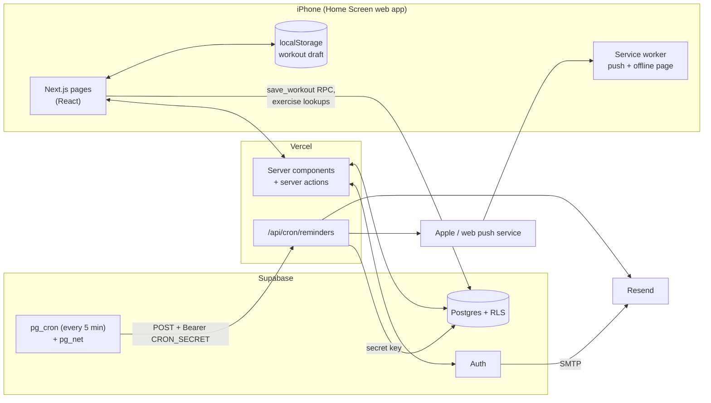

# Life Tracker: design

A private, installable web app for tracking gym sessions, body weight and to-dos, which nudges you by push notification or email when you haven't done something by a set time.

## Decisions

These were settled up front. The reasoning is kept so future changes can revisit it deliberately.

| Question | Decision | Why |
|----------|----------|-----|
| Stack | Next.js 16 (App Router) + TypeScript on Vercel | One codebase for UI and API routes. First-class on Vercel. Supabase's SSR auth helpers target it. |
| Users | Open sign-up; each user's data is private | Row-level security on every table, so the same code serves one user or fifty |
| Scale | Free, friends-and-family | Fits Vercel Hobby (non-commercial), Supabase Free, Resend Free. Monetising means Vercel Pro. |
| Sign-in | Email + password, email confirmation, Cloudflare Turnstile CAPTCHA | Magic links open in Safari, not the Home Screen app, which has separate cookies. Passwords autofill with Face ID via iCloud Keychain. |
| Workouts | Exercises × sets × reps × weight, with routines (templates) | Progressive-overload tracking needs set-level data |
| Exercises | 95 built-in + private custom ones | New users can log immediately |
| Units | Per-user kg/lb (km/mi for distance); always stored in kg / metres / seconds | Switching units never corrupts history |
| Offline | Draft saved on the phone; retries automatically | Gyms have bad signal. Full offline-first sync isn't worth the complexity yet. |
| Reminder kinds | Weight not logged by a time · no workout on a gym day · to-do due | The three "nudge me" cases asked for |
| Nagging | One reminder + one optional follow-up; "skip today" | Useful without being spammy, and friendly to the email quota |
| Channels | Per reminder: push / email / both; push falls back to email | Nothing is silently lost if a phone never enabled notifications |
| Scheduler | Supabase `pg_cron` every 5 min → `POST /api/cron/reminders` | Vercel Hobby cron runs at most once a day, which is useless for "by 9:00" |
| Other trackers | Not yet; kept easy to add | Ship the core well first |
| Extras | Charts, PRs, weekly streaks, rest timer, CSV export, account deletion | Asked for in the design interview |

## Architecture

- **Reads** happen in server components with the signed-in user's Supabase session, so RLS applies.
- **Writes** are server actions (weight, to-dos, reminders, settings), except the workout logger and routine editor. Those call Supabase RPCs straight from the browser, so the logger can retry saves after the connection comes back.
- **The secret (service-role) key** bypasses RLS, so it is only used for system work: the reminder dispatcher, the signed email dismiss link, saving push subscriptions (a device can move between accounts), and account deletion. That code is server-only.
- `proxy.ts` (Next 16's replacement for `middleware.ts`) refreshes the auth cookie on every request and sends signed-out visitors to `/login`.

## Data model

All weights are kg, distances metres, durations seconds. "Local" dates are `date` values in the user's timezone.

| Table | Purpose | Notes |
|-------|---------|-------|
| `profiles` | One per user: email, name, timezone, unit, weekly goal | Created by a trigger on sign-up from the form's metadata. Email isn't user-editable (column grants). |
| `weight_entries` | One weigh-in per local day | `unique (user_id, entry_date)`: logging twice updates |
| `exercises` | Built-in (`user_id is null`) + custom | `kind` decides what a set records: `weight_reps`, `bodyweight_reps`, `duration`, `distance_time` |
| `routines`, `routine_exercises` | Workout templates with target sets/reps/rest | Saved atomically by `save_routine()` |
| `workouts`, `workout_sets` | Logged sessions | `id` is generated on the phone, so `save_workout()` can be retried without duplicates. `is_pr` is stored at log time. |
| `todos`, `todo_completions` | One-off / daily / weekly / monthly tasks, and which days they were done | Monthly on the 29th–31st falls on the last day of shorter months |
| `reminders` | Rules: kind, local time, weekdays, channel, follow-up | `kind = 'todo'` links one-to-one to a to-do and follows its schedule |
| `reminder_events` | What was sent (or skipped) per reminder, day and stage | `unique (reminder_id, occurrence_date, stage)` is the lock that prevents double-sends |
| `push_subscriptions` | One per device with notifications on | Deleted automatically when the push service says the device is gone |

**Security model.** Every table has RLS: you can only see and change rows where `user_id` is you. Child tables use composite foreign keys (`(workout_id, user_id) → workouts(id, user_id)`), so a row can't point at another user's parent. Rows that reference an exercise also check you're allowed to use it. The anonymous role has no table access at all. These properties were tested by simulating two users in SQL (overwriting, reading, dismissing and referencing across accounts all fail).

## Reminder engine

Every 5 minutes, `pg_cron` calls `POST /api/cron/reminders` with `Authorization: Bearer CRON_SECRET`. The URL and secret come from Supabase Vault. `lib/reminders/dispatch.ts` then:

1. Loads every enabled reminder with its owner's timezone and email.
2. Uses the pure function `findDue()` in `lib/reminders/engine.ts` to decide, per reminder:
   - It **applies** on a local date if the weekday matches (or, for a to-do, if the to-do is due that day).
   - The **first notification** is due from the local time until 90 minutes after it (the grace window covers brief scheduler outages). Yesterday is also checked, so a 23:55 reminder still goes out if the run lands at 00:02.
   - The **follow-up** is due `follow_up_minutes` after the later of the scheduled time and the actual send.
   - A day that was **skipped** gets nothing. A reminder **created after its time** has passed starts tomorrow.
   - Daylight saving is handled by luxon. Times in the spring-forward gap move forward.
3. Drops anything **already done**: a weight entry that day, a workout that day, or the to-do ticked off.
4. **Claims** each send by inserting a `reminder_events` row with `ON CONFLICT DO NOTHING`. Only the run that gets the row back sends, so overlapping runs can't double-notify.
5. **Delivers**: push to every device, deleting dead subscriptions on 404/410. Then email if the channel asks for it, or as a fallback when a push-only reminder reached no device. Emails include a signed, 48-hour "dismiss for today" link. It needs a tap (a POST) so email link scanners can't trigger it.
6. Records `delivered_via` / `error` on the event, and returns a JSON summary that shows up in `net._http_response`.

## Workout logging and offline

- The draft (`lib/workout-draft.ts`) is stored in `localStorage` on every keystroke, keyed per user (and per workout when editing). Inputs are kept as typed strings in your unit and converted only on save.
- "Last time" hints and all-time bests come from the `exercise_snapshot()` RPC. PRs are computed live against those bests, plus earlier sets in the same session, so repeating a PR weight doesn't count twice. The first time you do an exercise sets a baseline and isn't a PR.
- **Finish** marks the draft `pendingSync` before uploading. If the upload fails for network reasons, the app says so and retries on the browser's `online` event and every 30 seconds. The Today and Train tabs show a "waiting to upload" banner. `save_workout()` is idempotent on the phone-generated id.
- The service worker serves a small offline page for navigations with no connection. Personal pages are never cached.

## Design system

iOS-style grouped surfaces and one green accent, following the phone's light/dark setting. Tokens live in `app/globals.css` (`bg-bg`, `bg-card`, `text-muted`, `bg-accent`…); components never use raw colours. Charts are dependency-free SVG (`components/line-chart.tsx`): 2px lines, ringed dots, hairline grid, a legend when there are two series, and a crosshair tooltip that also works with the arrow keys. The two chart colours were validated for colour-blind separation and contrast in both modes. The history lists double as the table view.

## Testing

- `npm test`: 40 unit tests for units, 1RM/PR logic, streaks, to-do schedules, the reminder engine (timezones, DST, grace window, follow-ups), signed links and CSV.
- The initial build was also checked end to end against a local Supabase stack (in a real browser at iPhone size):
  - Sign-up → confirmation email → routine → workout with PRs → reload survives → offline save → auto-upload → to-dos → reminders → CSV
  - The dispatcher with a fake push service and fake Resend: push payloads decrypted and checked, dead devices removed, email fallback, no duplicates, follow-up, dismiss link
  - `pg_cron` → `pg_net` → the app via Vault

## Extending

**Adding a tracker** (say, sleep):
1. Add a migration with a table shaped like `weight_entries` (`user_id`, `entry_date`, value, RLS policy, grants).
2. Add `app/(app)/sleep/` (page + `actions.ts`), reusing `LineChart` and the form components.
3. For reminders: add `'sleep'` to the `reminders.kind` check, a case in `buildMessage()`, and a "done today" query in `findAlreadyDone()`.
4. Link it from the More tab, or give it its own tab.

Ideas that fit the current design: passkey sign-in (Supabase now supports it), a home-screen widget-style summary, plate calculator, body-measurement tracking, and a weekly email digest.

## Map for Python developers

| Python / Django-ish idea | Here |
|--------------------------|------|
| `views.py` returning templates | `app/**/page.tsx` server components (async functions that query and return JSX) |
| Form POST handlers | `actions.ts` files with `"use server"` functions |
| `urls.py` | The folder structure under `app/` (`[id]` = path parameter; `(app)` = a group that doesn't change the URL) |
| Middleware | `proxy.ts` |
| Models + migrations | `supabase/migrations/*.sql` (plain SQL) + generated types in `lib/supabase/database.types.ts` |
| Permissions | Postgres row-level security policies, enforced by the database itself |
| Celery beat | Supabase `pg_cron` calling an HTTP endpoint |
| pytest | Vitest (`tests/*.test.ts`) |
